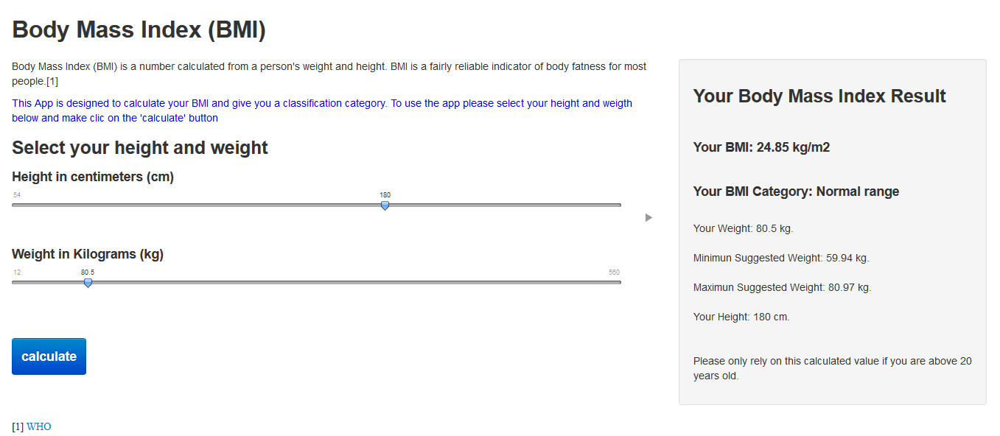

## Introduction


* This document presents a Shiny app developed to calculate the Body Mass Index of a person, with the weight and height information.


* The Shiny App also gives as result the clasification of the Body Mass Index and a suggested range of weight.


--- .class #id
## Body Mass Index


### Definition
Body Mass Index (BMI) is a number calculated from a person's weight and height. BMI is a fairly reliable indicator of body fatness for most people. BMI does not measure body fat directly, but research has shown that BMI correlates to direct measures of body fat, such as underwater weighing and dual energy x-ray absorptiometry (DXA).1, 2 BMI can be considered an alternative for direct measures of body fat. Additionally, BMI is an inexpensive and easy-to-perform method of screening for weight categories that may lead to health problems.[1]

### Use of BMI
BMI is used as a screening tool to identify possible weight problems for adults. However, BMI is not a diagnostic tool. For example, a person may have a high BMI. However, to determine if excess weight is a health risk, a healthcare provider would need to perform further assessments. These assessments might include skinfold thickness measurements, evaluations of diet, physical activity, family history, and other appropriate health screenings.[1]


--- .class #id 
## Body Mass Index - Shiny App

This is a screen image of the shiny app published in the following website:

https://hdhe.shinyapps.io/App-bmi/

<center></center>


--- .class #id 
## Shiny App .R Code - part 1

To calculate the BMI, this is the code used in server.R with some data example:

```{r, results='asis', echo=TRUE, size="scriptsize"}
#Firs we create some data example

input <- data.frame(weight = 80, height = 180)
BMI <- round((input$weight / ((input$height / 100)^2)),2)

# This is the calculated BMI
BMI
```

--- .class #id  

## Shiny App .R Code - part 2

To calculate the classification, this is the code used in server.R with some data example:

```{r, results='asis', echo=TRUE, size="scriptsize"}
# Now we identify the category of the BMI

if(BMI < 16.00) {category <- ("Severe thinness")} 
if(16.00 <= BMI & BMI <= 16.99) {category <- ("Moderate thinness")} 
if(17.00 <= BMI & BMI <= 18.49) {category <- ("Mild thinness")} 
if(18.50 <= BMI & BMI <= 24.99) {category <- ("Normal range")} 
if(25.00 <= BMI & BMI <= 29.99) {category <- ("Pre-obese")} 
if(30.00 <= BMI & BMI <= 34.99) {category <- ("Obese class I")} 
if(35.00 <= BMI & BMI <= 39.99) {category <- ("Obese class II")} 
if(BMI >= 40.00) {category <- ("Obese class III")}            

paste("Your BMI Category:",category)
```

--- .class #id  

## References

[1] World Health Organization: 
http://www.cdc.gov/healthyweight/assessing/bmi/adult_bmi/index.html